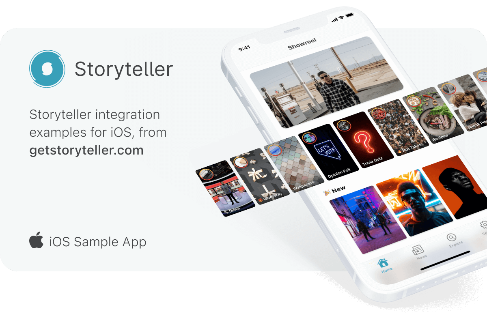

# Storyteller iOS Sample App

## CocoaPods-Sample

This sample app uses our [Cocoapods](https://cocoapods.org) integration (`Storyteller`), so you must:
1. [Install CocoaPods](http://guides.cocoapods.org/using/getting-started.html)
2. Supply your SDK license key in the `Podfile` by replacing `[LICENSEKEY]` with the correct value (please refer to our guide to [Referencing the SDK](https://docs.getstoryteller.com/documents/ios-sdk/GettingStarted#cocoapods) for more details)
3. Run `pod install` in the `Cocoapods-Sample` directory
4. Open the `StorytellerSampleApp.xcworkspace` to open the project.
5. Supply your app's API Key in `ViewController.swift` by replacing `[APIKEY]` with the correct value (please refer to our guide on [Initializing the SDK](https://docs.getstoryteller.com/documents/ios-sdk/GettingStarted#sdk-initialization) for more details)

## Carthage-Sample

This sample app uses our [Carthage](https://github.com/Carthage/Carthage) integration (`Storyteller`), so you must:
1. [Install Carthage](https://github.com/Carthage/Carthage#installing-carthage)
2. Supply your Carthage feed URL in the `Cartfile` by replacing `[CARTHAGEFEEDURL]` with the correct value (please refer to our guide to [Referencing the SDK](https://docs.getstoryteller.com/documents/ios-sdk/GettingStarted#carthage) for more details)
3. Run `carthage update` in the `Carthage-Sample` directory
4. Open the `StorytellerSampleApp.xcodeproj` to open the project.
5. Ensure the framework output by Carthage is included in your list of frameworks to be copied (see [Carthage's guides](https://github.com/Carthage/Carthage#if-youre-building-for-ios-tvos-or-watchos) for instructions on how to do so)
6. Supply your app's API Key in `ViewController.swift` by replacing `[APIKEY]` with the correct value (please refer to our guide on [Initializing the SDK](https://docs.getstoryteller.com/documents/ios-sdk/GettingStarted#sdk-initialization) for more details)

## XCFrameworks-Sample

This sample app uses our XCFrameworks integration (`Storyteller`), so you must:
1. Download zipped binaries from the URL provided (please refer to our guide to [Referencing the SDK](https://docs.getstoryteller.com/documents/ios-sdk/GettingStarted#xcframeworks) for more details)
2. Copy them to `Libraries` folder. Path should look like: `Libraries/StorytellerSDK.xcframework`, `Libraries/AsyncDisplayKit.xcframework`, etc.
3. Open the `StorytellerSampleApp.xcodeproj` to open the project.
4. Ensure the frameworks are listed under `Libraries` group.
5. Supply your app's API Key in `ViewController.swift` by replacing `[APIKEY]` with the correct value (please refer to our guide on [Initializing the SDK](https://docs.getstoryteller.com/documents/ios-sdk/GettingStarted#sdk-initialization) for more details)
